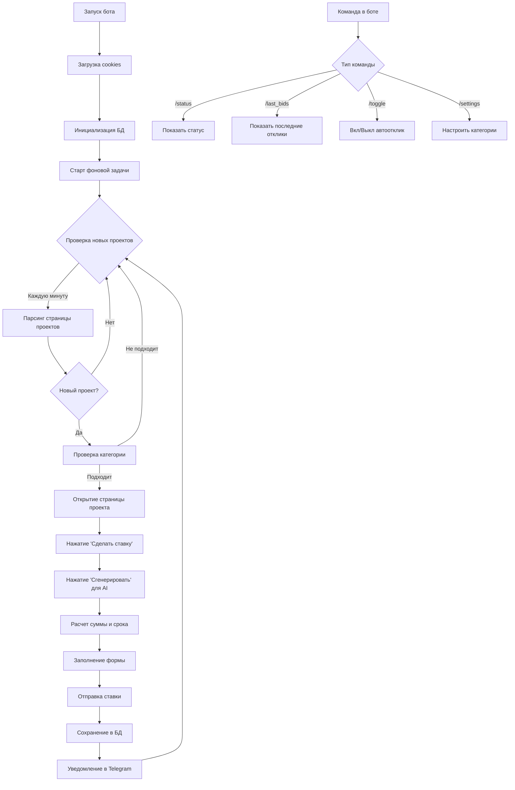

# План проекта: Telegram бот для автооткликов на Freelancehunt

## Архитектура проекта

Проект состоит из следующих компонентов:

1. **Telegram бот** - интерфейс управления и мониторинга
2. **Автоматизация браузера** - взаимодействие с сайтом Freelancehunt
3. **Парсер проектов** - отслеживание новых проектов
4. **База данных** - хранение истории откликов
5. **Конфигурация** - настройки категорий, интервалов проверки

## Структура файлов

```javascript
otklikushka/
├── bot.py                      # Основной файл Telegram бота
├── browser_automation.py       # Автоматизация браузера (Selenium/Playwright)
├── freelancehunt_scraper.py    # Парсинг и мониторинг проектов
├── database.py                 # Работа с базой данных
├── config.py                   # Конфигурация проекта
├── requirements.txt            # Зависимости Python
├── .env.example                # Пример файла с переменными окружения
├── .gitignore                  # Игнорируемые файлы
└── README.md                   # Документация
```


## Компоненты системы

### 1. Telegram бот (`bot.py`)

**Функционал:**

- Команда `/start` - запуск бота и проверка статуса
- Команда `/status` - текущий статус работы (вкл/выкл, последняя проверка)
- Команда `/last_bids` - список последних N откликов (проект, время, сумма, статус)
- Команда `/settings` - настройка категорий проектов
- Команда `/toggle` - включить/выключить автоматический отклик
- Автоматические уведомления о новых откликах

**Используемые библиотеки:**

- `python-telegram-bot` или `aiogram` для работы с Telegram API
- Асинхронная обработка команд

### 2. Автоматизация браузера (`browser_automation.py`)

**Функционал:**

- Инициализация браузера с сохраненными cookies (авторизация)
- Навигация по странице проекта
- Нажатие кнопки "Сделать ставку"
- Нажатие кнопки "Сгенерировать" для AI-генерации текста ставки
- Заполнение полей:
- Сумма (на основе бюджета проекта, но не выше 27,000 грн)
- Срок выполнения (на основе указанного срока в проекте)
- Отправка ставки
- Обработка ошибок и исключений

**Используемые библиотеки:**

- `selenium` или `playwright` для автоматизации браузера
- Headless режим для работы в фоне

**Особенности:**

- Сохранение и загрузка cookies для авторизации
- Ожидание загрузки элементов страницы
- Retry-логика при ошибках

### 3. Парсер проектов (`freelancehunt_scraper.py`)

**Функционал:**

- Парсинг страницы `/projects` с фильтрацией по категориям
- Определение новых проектов (сравнение с БД)
- Извлечение данных проекта:
- ID проекта
- Название
- Категория
- Бюджет (если указан)
- Срок выполнения (если указан)
- URL проекта
- Время публикации
- Фильтрация только "свежих" проектов (например, опубликованных за последний час)

**Используемые библиотеки:**

- `beautifulsoup4` или `selenium` для парсинга
- `requests` для HTTP-запросов

### 4. База данных (`database.py`)

**Структура таблиц:projects** - информация о проектах:

- `id` (PRIMARY KEY) - ID проекта на Freelancehunt
- `title` - название проекта
- `category` - категория проекта
- `budget` - бюджет проекта (если указан)
- `deadline` - срок выполнения из проекта (если указан)
- `url` - ссылка на проект
- `created_at` - время публикации проекта
- `first_seen_at` - когда проект был обнаружен ботом

**bids** - история откликов:

- `id` (PRIMARY KEY, AUTO_INCREMENT)
- `project_id` (FOREIGN KEY) - связь с проектом
- `bid_amount` - сумма ставки
- `bid_deadline` - указанный срок выполнения
- `status` - статус отклика (pending, sent, failed)
- `created_at` - время создания отклика
- `sent_at` - время отправки ставки

**settings** - настройки бота:

- `key` (PRIMARY KEY) - ключ настройки
- `value` - значение настройки
- Например: `enabled` (true/false), `check_interval` (60 секунд), `categories` (JSON список)

**Используемые библиотеки:**

- `sqlite3` или `sqlalchemy` для работы с БД
- SQLite как легковесная БД

### 5. Конфигурация (`config.py`)

**Переменные:**

- `TELEGRAM_BOT_TOKEN` - токен бота (8369104694:AAEWBhegpsS_O0K175jYA8CgE6bJwq4uA1w)
- `FREELANCEHUNT_URL` - базовый URL сайта
- `COOKIES_FILE` - путь к файлу с cookies
- `DATABASE_FILE` - путь к файлу БД
- `MAX_BID_AMOUNT` - максимальная сумма ставки (27000)
- `CHECK_INTERVAL` - интервал проверки (60 секунд)
- `DEFAULT_CATEGORIES` - список категорий по умолчанию (настраивается через бота)

## Поток работы




## Алгоритм определения суммы и срока

**Сумма ставки:**

- Если в проекте указан бюджет → использовать его (но не выше 27,000 грн)
- Если бюджет не указан → случайная сумма в диапазоне 10,000 - 27,000 грн
- Можно добавить логику: для маленьких проектов меньше, для больших - больше

**Срок выполнения:**

- Если в проекте указан желаемый срок → использовать его
- Если не указан → дефолтный срок (например, 14 дней)
- Или можно рассчитать на основе сложности/бюджета

## Безопасность и ограничения

1. **Cookies:** Сохранять cookies в безопасном месте, не коммитить в git
2. **Rate limiting:** Добавить задержки между действиями, чтобы не заблокировали аккаунт
3. **Ошибки:** Обрабатывать все исключения, логировать ошибки
4. **Валидация:** Проверять, что проект еще доступен перед откликом

## Зависимости (requirements.txt)

```javascript
python-telegram-bot==20.7
selenium==4.15.0
beautifulsoup4==4.12.2
requests==2.31.0
python-dotenv==1.0.0
sqlalchemy==2.0.23
playwright==1.40.0  # Альтернатива Selenium
aiohttp==3.9.1
```


## Этапы реализации

1. **Настройка окружения:** Создание структуры проекта, установка зависимостей
2. **База данных:** Создание схемы БД и функций для работы с ней
3. **Конфигурация:** Настройка файлов конфигурации и .env
4. **Парсер:** Реализация парсинга страницы проектов
5. **Автоматизация браузера:** Реализация автоматического отклика
6. **Telegram бот:** Создание интерфейса бота с командами
7. **Интеграция:** Связывание всех компонентов, фоновые задачи
8. **Тестирование:** Проверка работы на тестовых проектах
9. **Документация:** Написание README с инструкциями

## Важные замечания

- **Авторизация:** Пользователю нужно будет один раз авторизоваться в браузере, после чего cookies будут сохранены
- **Категории:** Изначально можно добавить возможность указать категории через команду `/settings` в боте
- **Мониторинг:** Бот должен показывать реальное время последних откликов и их статусы
- **Остановка:** Должна быть возможность быстро остановить автоматический отклик через `/toggle`

## Дополнительные возможности (опционально)